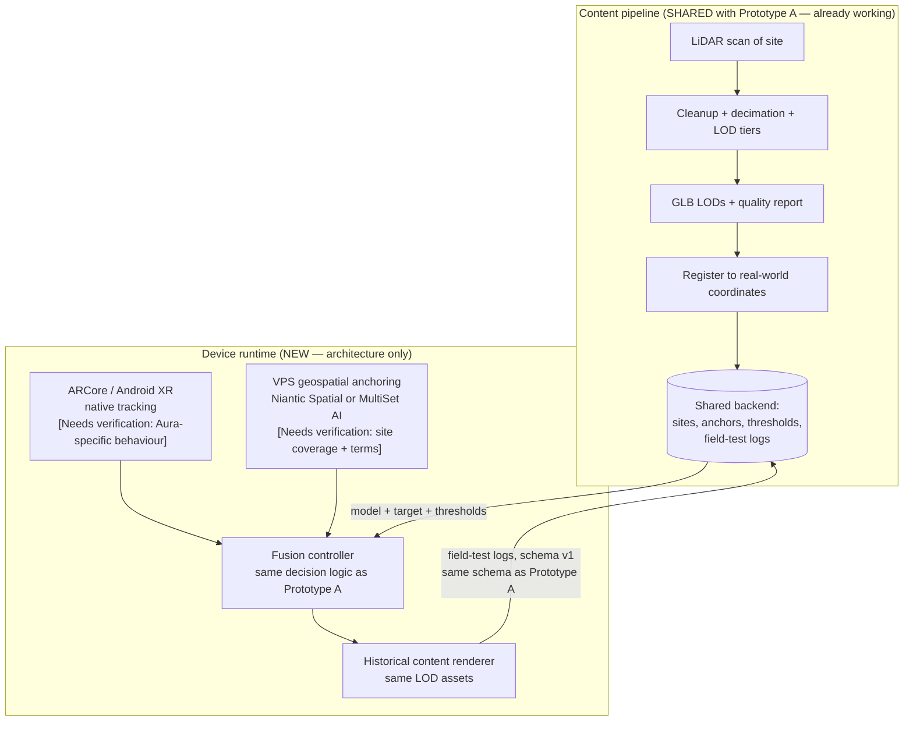
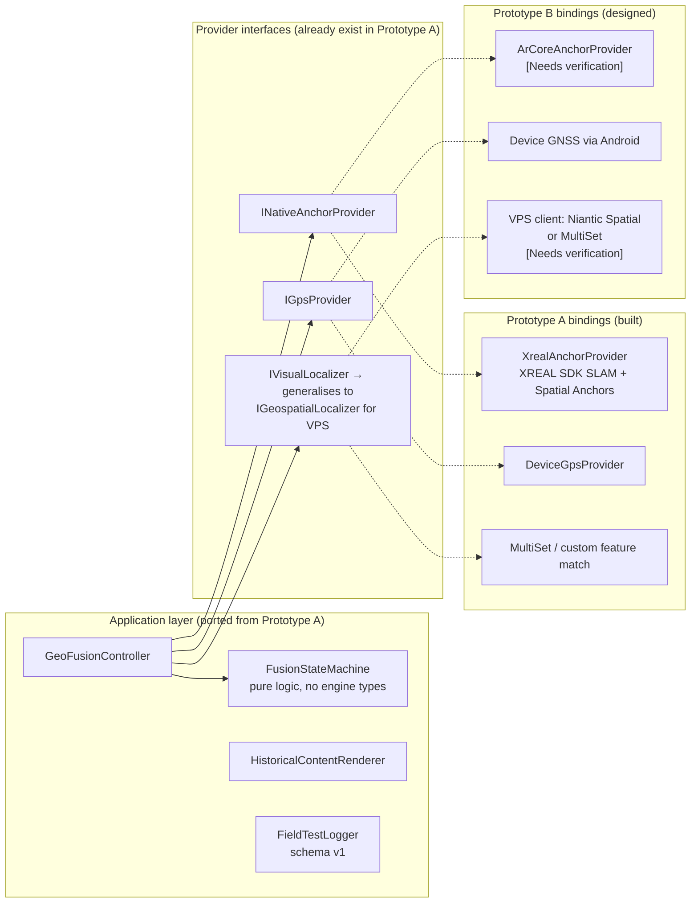
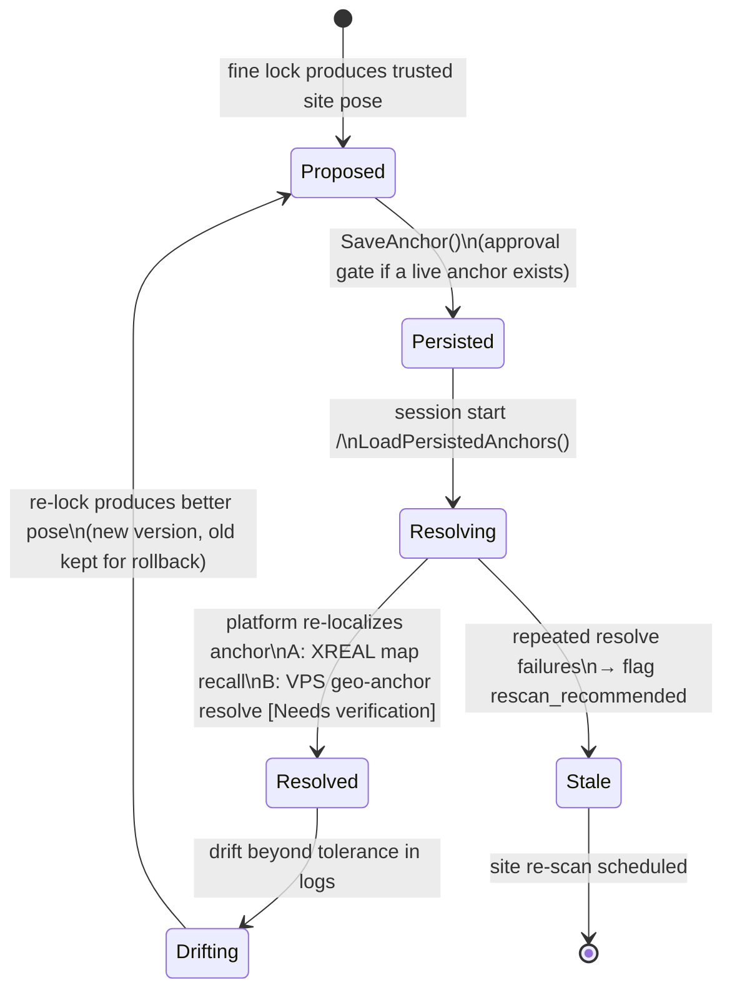
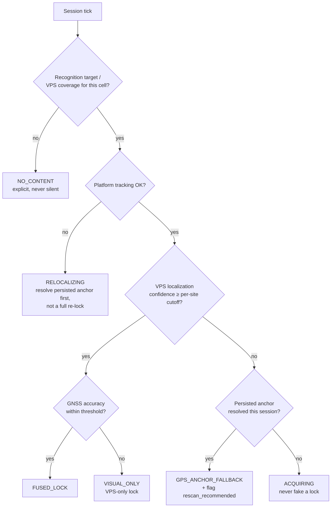

# Prototype B Architecture

**Framing rule for this document:** Prototype B is *designed*, not built. The
target device (XREAL Aura, powered by Android XR, Snapdragon Reality Elite —
Fall 2026, dev kits earlier) does not exist in our hands. Diagrams describe
intended structure; every integration point that cannot be tested today is
tagged **[Needs verification]**.

---

## 1. System data flow

The content pipeline is Prototype A's, unchanged. Only the two shaded device
layers are new.

**What this buys us:** every box in the top half exists and is tested today.
Prototype B's risk is concentrated in exactly two integrations, both behind
interfaces Prototype A already defines.

---

## 2. Layer separation: tracking vs geospatial

Spec quality check: *"the architecture cleanly separates ARCore/Android XR
tracking from the VPS/geospatial layer, so either can be swapped."*

Key design decision carried over from Prototype A: the fusion core
(`FusionStateMachine`) contains no engine or SDK types and is mirrored by a
tested Python reference implementation. Prototype B reuses it as-is; only the
provider bindings change.

One interface generalisation is needed: Prototype A's `IVisualLocalizer`
returns a target pose in *session* space; a VPS returns geo-anchored poses in
*earth* space. Plan: extend the seam to `IGeospatialLocalizer` returning
`(pose, coordinate_frame, confidence)`, with Prototype A's implementation
reporting `coordinate_frame = session`. This is the only cross-prototype
refactor identified so far (see migration doc).

---

## 3. Anchor lifecycle

Spec quality check: *"the anchor-persistence model is compatible with both
Prototype A's Spatial Anchors and a future VPS-based approach."* The lifecycle
below is identical for both; only the *resolve* mechanism differs.

Persistence records in the shared backend already carry
`anchor_handle` (provider-scoped, opaque) + WGS84 lat/lon/alt — deliberately
provider-agnostic so an XREAL map handle and a VPS geo-anchor ID are stored
identically.

---

## 4. Fallback chain

Spec quality check: *"the fallback logic (GPS → VPS → last-known-anchor) is
specified even though untestable today."* This is Prototype A's tested decision
table with VPS substituted for the visual fine lock; states and log schema are
unchanged, which is what lets the shared self-learning loop ingest Prototype B
sessions from day one.

Coarse-fallback note from the spec's competitive landscape: Google's ARCore
Geospatial API (Street View-based VPS) is street-level only — weak for a chapel
interior, but worth keeping as an additional coarse layer between GNSS and the
partner VPS. Recorded here as a design option, not a commitment.

---

## 5. What must be tested the day dev-kit access opens

1. ARCore/Android XR anchor persistence semantics on Aura (map recall vs
   cloud anchors vs VPS-native persistence) — **[Needs verification]**
2. Chosen VPS partner's coverage/mapping workflow for the test site,
   including whether our existing LiDAR captures can seed their localization
   map — **[Needs verification]** (MultiSet's published claim of direct
   LiDAR/E57 ingestion is a point in its favour here; see comparison doc)
3. Confidence-score semantics of the VPS SDK, so per-site thresholds and the
   self-learning loop transfer meaningfully
4. Real GNSS behaviour on Aura hardware (glasses vs tethered phone)
5. Thermal/battery envelope for the LOD budgets inherited from Prototype A
